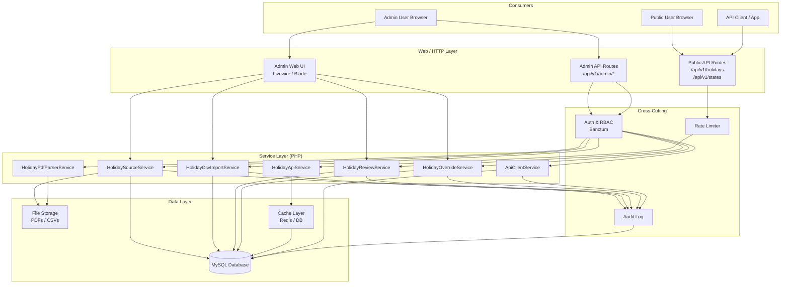
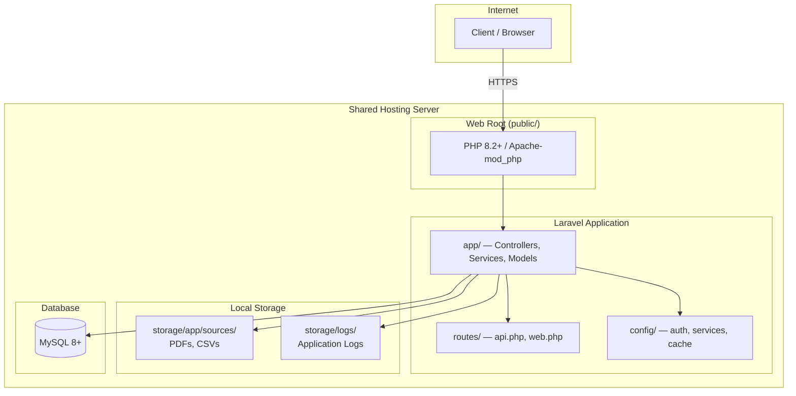
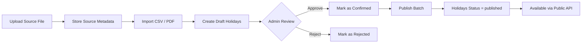
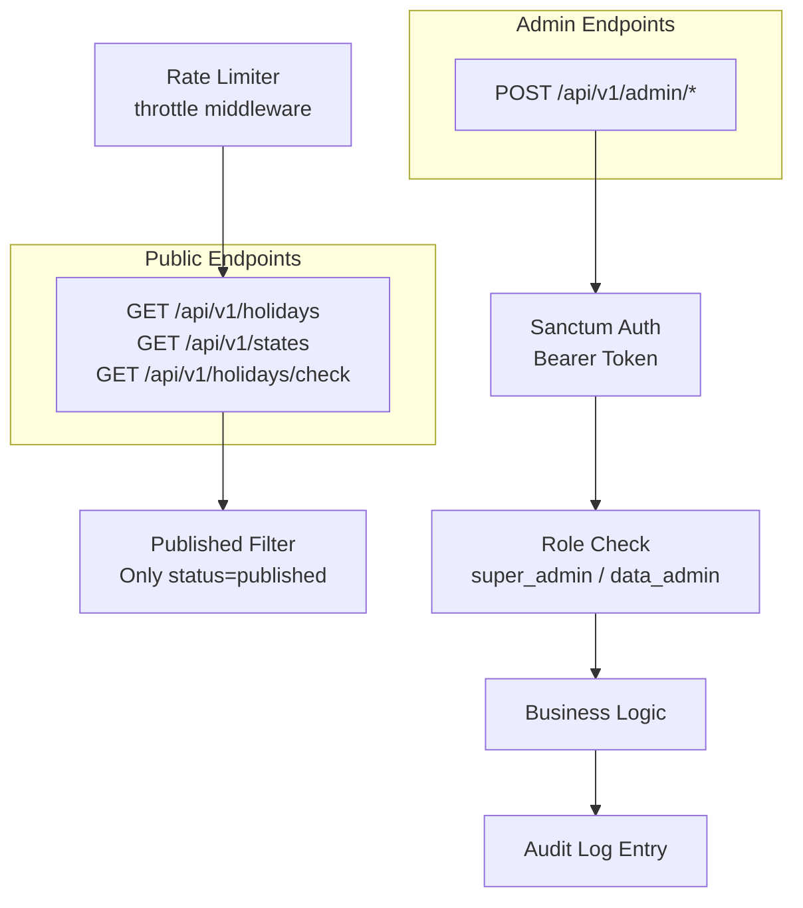

# System Architecture — Malaysia Public Holiday API

## Overview

The Malaysia Public Holiday API is a **Laravel-based** backend system that ingests, reviews, and serves verified Malaysian public holiday data. The architecture follows a layered, service-oriented design with a strict admin-gated publish workflow.

---

## High-Level Component Diagram

---

## Deployment Diagram (Shared Hosting)

> **Note for VPS/Cloud:** Add a Redis cache node, a queue worker process, and an object storage bucket (e.g. S3) for uploaded files.

---

## Application Layer Breakdown

| Layer | Components | Responsibility |
|---|---|---|
| **HTTP / Route** | `api.php`, `web.php` | Route binding, middleware groups |
| **Controller** | `HolidayController`, `HolidaySourceController`, `HolidayImportController`, `HolidayOverrideController`, `StateController` | Request validation, delegate to service |
| **Form Request** | `StoreHolidaySourceRequest`, `ImportCsvRequest`, etc. | Input validation & authorization |
| **Service** | `HolidaySourceService`, `HolidayCsvImportService`, `HolidayReviewService`, `HolidayOverrideService`, `HolidayApiService` | Business logic |
| **Model / Eloquent** | `HolidaySource`, `HolidayImportBatch`, `Holiday`, `HolidayOverride`, `ApiClient` | ORM & query scopes |
| **API Resource** | `HolidayResource`, `HolidayCollection`, `StateResource` | Response shaping |
| **Middleware** | `auth:sanctum`, `throttle`, `can:manage-holidays` | Auth, rate limit, permission gate |
| **Observers / Events** | `HolidayObserver`, `AuditLogger` | Side-effects, audit log |

---

## Data Flow — Holiday Publish Workflow

---

## Security Architecture

---

## Caching Strategy

| Data | Cache Key Pattern | TTL | Invalidation Trigger |
|---|---|---|---|
| Holidays by year | `holidays.{year}` | 1 hour | Batch published |
| Holidays by year + state | `holidays.{year}.{state}` | 1 hour | Batch published or override applied |
| State list | `states.all` | 24 hours | Manual cache clear |
| Holiday check | `holiday.check.{date}.{state}` | 1 hour | Override applied |
