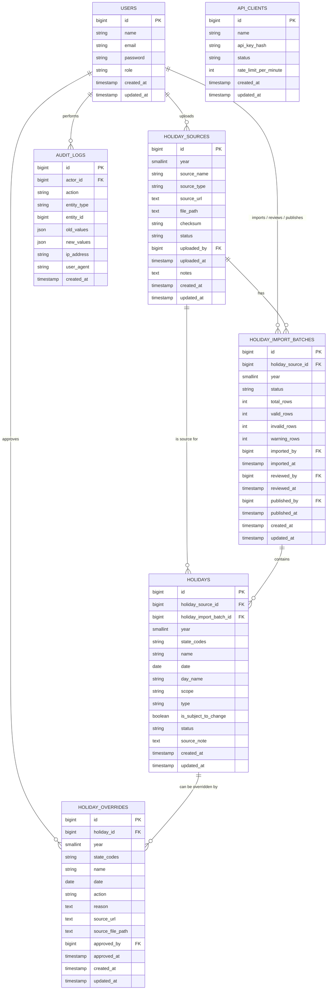

# Database Design — Malaysia Public Holiday API

## Entity Relationship Diagram (ERD)

---

## Table Reference

### `users`

Standard Laravel auth table. Extended with a `role` column.

| Column | Type | Nullable | Notes |
|---|---|---|---|
| `id` | BIGINT UNSIGNED PK | No | Auto-increment |
| `name` | VARCHAR(255) | No | Display name |
| `email` | VARCHAR(255) UNIQUE | No | Login credential |
| `password` | VARCHAR(255) | No | Hashed |
| `role` | ENUM(`super_admin`, `data_admin`) | No | Default `data_admin` |
| `created_at` | TIMESTAMP | Yes | |
| `updated_at` | TIMESTAMP | Yes | |

---

### `holiday_sources`

Stores metadata for each uploaded source document.

| Column | Type | Nullable | Notes |
|---|---|---|---|
| `id` | BIGINT UNSIGNED PK | No | |
| `year` | SMALLINT | No | Covered holiday year |
| `source_name` | VARCHAR(255) | No | Human-readable label |
| `source_type` | VARCHAR(50) | No | See enum below |
| `source_url` | TEXT | Yes | Official URL |
| `file_path` | TEXT | Yes | Local storage path |
| `checksum` | VARCHAR(128) | Yes | SHA-256 of file |
| `status` | VARCHAR(30) | No | `draft` / `active` |
| `uploaded_by` | BIGINT FK → `users.id` | Yes | |
| `uploaded_at` | TIMESTAMP | Yes | |
| `notes` | TEXT | Yes | Admin notes |

**`source_type` enum:** `federal_pdf` · `state_page` · `gazette` · `admin_csv` · `manual_entry` · `third_party_reference`

---

### `holiday_import_batches`

Tracks one CSV or PDF import run linked to a source.

| Column | Type | Nullable | Notes |
|---|---|---|---|
| `id` | BIGINT UNSIGNED PK | No | |
| `holiday_source_id` | BIGINT FK → `holiday_sources.id` | No | |
| `year` | SMALLINT | No | |
| `status` | VARCHAR(30) | No | See status enum |
| `total_rows` | INT | No | Default 0 |
| `valid_rows` | INT | No | Default 0 |
| `invalid_rows` | INT | No | Default 0 |
| `warning_rows` | INT | No | Default 0 |
| `imported_by` | BIGINT FK → `users.id` | Yes | |
| `imported_at` | TIMESTAMP | Yes | |
| `reviewed_by` | BIGINT FK → `users.id` | Yes | |
| `reviewed_at` | TIMESTAMP | Yes | |
| `published_by` | BIGINT FK → `users.id` | Yes | |
| `published_at` | TIMESTAMP | Yes | |

**`status` enum:** `draft` · `parsed` · `review_required` · `approved` · `published` · `rejected`

---

### `holidays`

The central table. Each row is one holiday entry for a specific state and date.

| Column | Type | Nullable | Notes |
|---|---|---|---|
| `id` | BIGINT UNSIGNED PK | No | |
| `holiday_source_id` | BIGINT FK → `holiday_sources.id` | Yes | |
| `holiday_import_batch_id` | BIGINT FK → `holiday_import_batches.id` | Yes | |
| `year` | SMALLINT | No | |
| `state_codes` | VARCHAR(10) | No | ISO-like code e.g. `SBH` |
| `name` | VARCHAR(255) | No | |
| `date` | DATE | No | |
| `day_name` | VARCHAR(20) | Yes | e.g. `Monday` |
| `scope` | VARCHAR(30) | No | `federal` / `state` / `custom` |
| `type` | VARCHAR(50) | No | See type enum |
| `is_subject_to_change` | BOOLEAN | No | Default `FALSE` |
| `status` | VARCHAR(30) | No | See status enum |
| `source_note` | TEXT | Yes | |

**Indexes:**
- `idx_holidays_year_state (year, state_codes)` — primary query pattern
- `idx_holidays_date_state (date, state_codes)` — date-check endpoint
- `UNIQUE (year, state_codes, date, name)` — deduplication

**`scope` enum:** `federal` · `state` · `custom`

**`type` enum:** `federal` · `state` · `replacement` · `additional` · `custom`

**`status` enum:** `draft` · `confirmed` · `published` · `overridden` · `cancelled`

---

### `holiday_overrides`

Admin-created corrections, additions, or removals on top of published holidays.

| Column | Type | Nullable | Notes |
|---|---|---|---|
| `id` | BIGINT UNSIGNED PK | No | |
| `holiday_id` | BIGINT FK → `holidays.id` | Yes | NULL for `add` action |
| `year` | SMALLINT | No | |
| `state_codes` | VARCHAR(10) | No | |
| `name` | VARCHAR(255) | No | |
| `date` | DATE | No | |
| `action` | VARCHAR(30) | No | See action enum |
| `reason` | TEXT | Yes | |
| `source_url` | TEXT | Yes | |
| `source_file_path` | TEXT | Yes | |
| `approved_by` | BIGINT FK → `users.id` | Yes | |
| `approved_at` | TIMESTAMP | Yes | |

**Indexes:**
- `idx_overrides_year_state (year, state_codes)`
- `idx_overrides_date_state (date, state_codes)`

**`action` enum:** `add` · `remove` · `replace` · `rename` · `mark_subject_to_change`

---

### `audit_logs`

Immutable append-only event log for all admin actions.

| Column | Type | Nullable | Notes |
|---|---|---|---|
| `id` | BIGINT UNSIGNED PK | No | |
| `actor_id` | BIGINT FK → `users.id` | Yes | NULL = system |
| `action` | VARCHAR(100) | No | e.g. `holiday_published` |
| `entity_type` | VARCHAR(100) | No | e.g. `Holiday` |
| `entity_id` | BIGINT | Yes | |
| `old_values` | JSON | Yes | Snapshot before |
| `new_values` | JSON | Yes | Snapshot after |
| `ip_address` | VARCHAR(45) | Yes | |
| `user_agent` | TEXT | Yes | |
| `created_at` | TIMESTAMP | No | |

---

## Index Strategy

| Table | Index | Columns | Purpose |
|---|---|---|---|
| `holidays` | `idx_holidays_year_state` | `year, state_codes` | Main list query |
| `holidays` | `idx_holidays_date_state` | `date, state_codes` | Check-date query |
| `holidays` | `unique_holiday_record` | `year, state_codes, date, name` | Deduplication |
| `holiday_overrides` | `idx_overrides_year_state` | `year, state_codes` | Override lookup |
| `holiday_overrides` | `idx_overrides_date_state` | `date, state_codes` | Override date check |
| `audit_logs` | `idx_audit_entity` | `entity_type, entity_id` | Entity history |
| `audit_logs` | `idx_audit_actor` | `actor_id` | User activity |

---

## State Code Reference

| Code | State / Territory |
|---|---|
| `JHR` | Johor |
| `KDH` | Kedah |
| `KTN` | Kelantan |
| `MLK` | Melaka |
| `NSN` | Negeri Sembilan |
| `PHG` | Pahang |
| `PRK` | Perak |
| `PLS` | Perlis |
| `PNG` | Pulau Pinang |
| `SBH` | Sabah |
| `SWK` | Sarawak |
| `SGR` | Selangor |
| `TRG` | Terengganu |
| `KUL` | W.P. Kuala Lumpur |
| `LBN` | W.P. Labuan |
| `PJY` | W.P. Putrajaya |
