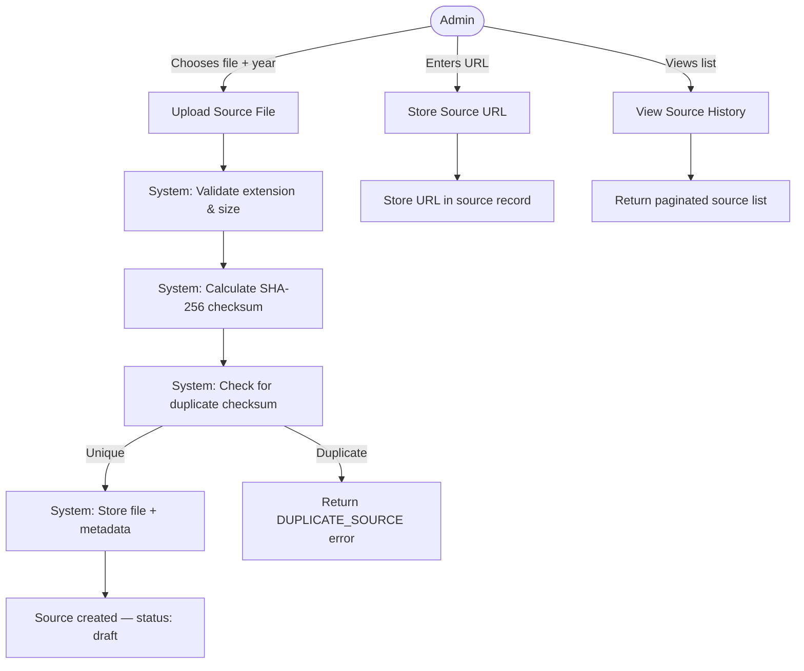
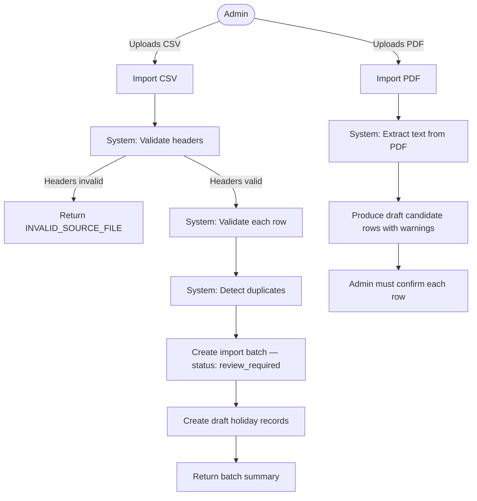
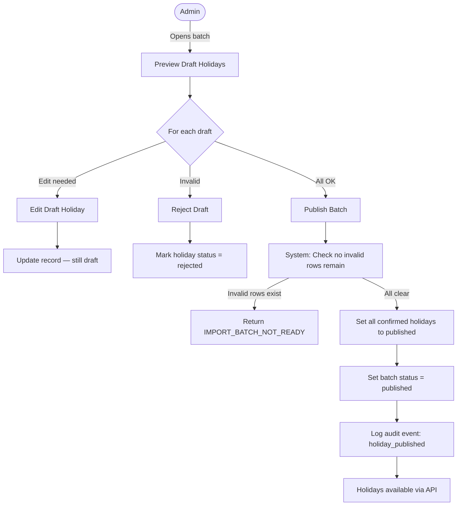
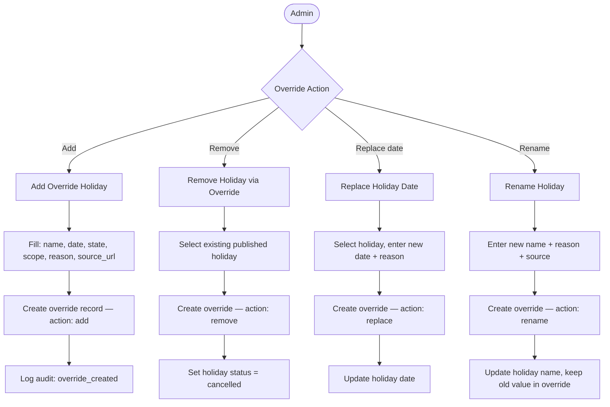
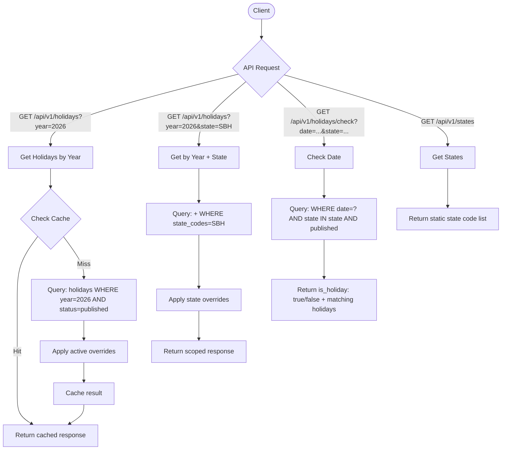

# Use Case Diagrams — Malaysia Public Holiday API

## 1. Actor Overview

| Actor | Description |
|---|---|
| **Super Admin** | Full system access: users, sources, publish, override, audit |
| **Data Admin** | Manages holiday data: upload, import, review, publish |
| **API Client** | Authenticated external app consuming the API |
| **Public User** | Unauthenticated user reading public holiday data |
| **System** | Automated actions (checksum, duplicate detection, validation) |

---

## 2. Master Use Case Diagram

```mermaid
graph LR
    SA(["👑 Super Admin"])
    DA(["🗂️ Data Admin"])
    AC(["🔌 API Client"])
    PU(["🌐 Public User"])
    SYS(["⚙️ System"])

    subgraph Source Management
        UC1[Upload Source File]
        UC2[Store Source URL]
        UC3[View Source History]
    end

    subgraph Holiday Import
        UC4[Import CSV File]
        UC5[Import PDF File]
        UC6[View Import Batch Results]
        UC7[View Validation Errors]
    end

    subgraph Review & Publishing
        UC8[Preview Draft Holidays]
        UC9[Edit Draft Holiday]
        UC10[Reject Draft Holiday]
        UC11[Publish Import Batch]
    end

    subgraph Override Management
        UC12[Add Override Holiday]
        UC13[Remove Holiday via Override]
        UC14[Replace Holiday Date]
        UC15[Rename Holiday]
    end

    subgraph Public API
        UC16[Get Holidays by Year]
        UC17[Get Holidays by Year and State]
        UC18[Check if Date is Holiday]
        UC19[Get Supported States]
    end

    subgraph User & Client Management
        UC20[Manage Users]
        UC21[Create API Client]
        UC22[Disable API Client]
        UC23[View Audit Logs]
    end

    subgraph Automated System
        UC24[Calculate File Checksum]
        UC25[Detect Duplicate Holidays]
        UC26[Validate CSV Rows]
        UC27[Log Audit Events]
    end

    SA --> UC1
    SA --> UC2
    SA --> UC3
    SA --> UC4
    SA --> UC5
    SA --> UC6
    SA --> UC7
    SA --> UC8
    SA --> UC9
    SA --> UC10
    SA --> UC11
    SA --> UC12
    SA --> UC13
    SA --> UC14
    SA --> UC15
    SA --> UC20
    SA --> UC21
    SA --> UC22
    SA --> UC23

    DA --> UC1
    DA --> UC2
    DA --> UC3
    DA --> UC4
    DA --> UC5
    DA --> UC6
    DA --> UC7
    DA --> UC8
    DA --> UC9
    DA --> UC10
    DA --> UC11
    DA --> UC12

    AC --> UC16
    AC --> UC17
    AC --> UC18
    AC --> UC19

    PU --> UC16
    PU --> UC17
    PU --> UC18
    PU --> UC19

    SYS --> UC24
    SYS --> UC25
    SYS --> UC26
    SYS --> UC27
```

---

## 3. Use Case: Source Management

---

## 4. Use Case: Holiday Import

---

## 5. Use Case: Review and Publishing

---

## 6. Use Case: Holiday Override

---

## 7. Use Case: Public API Access

---

## 8. CRUD Permission Matrix

| Use Case | Super Admin | Data Admin | API Client | Public User |
|---|---|---|---|---|
| Upload Source | ✅ | ✅ | ❌ | ❌ |
| Import CSV | ✅ | ✅ | ❌ | ❌ |
| Import PDF | ✅ | ✅ | ❌ | ❌ |
| Edit Draft | ✅ | ✅ | ❌ | ❌ |
| Reject Draft | ✅ | ✅ | ❌ | ❌ |
| Publish Batch | ✅ | ✅ | ❌ | ❌ |
| Add Override | ✅ | ✅ | ❌ | ❌ |
| Remove Override | ✅ | ❌ | ❌ | ❌ |
| Manage Users | ✅ | ❌ | ❌ | ❌ |
| Create API Client | ✅ | ❌ | ❌ | ❌ |
| View Audit Logs | ✅ | ❌ | ❌ | ❌ |
| Get Holidays (API) | ✅ | ✅ | ✅ | ✅ |
| Check Date (API) | ✅ | ✅ | ✅ | ✅ |
