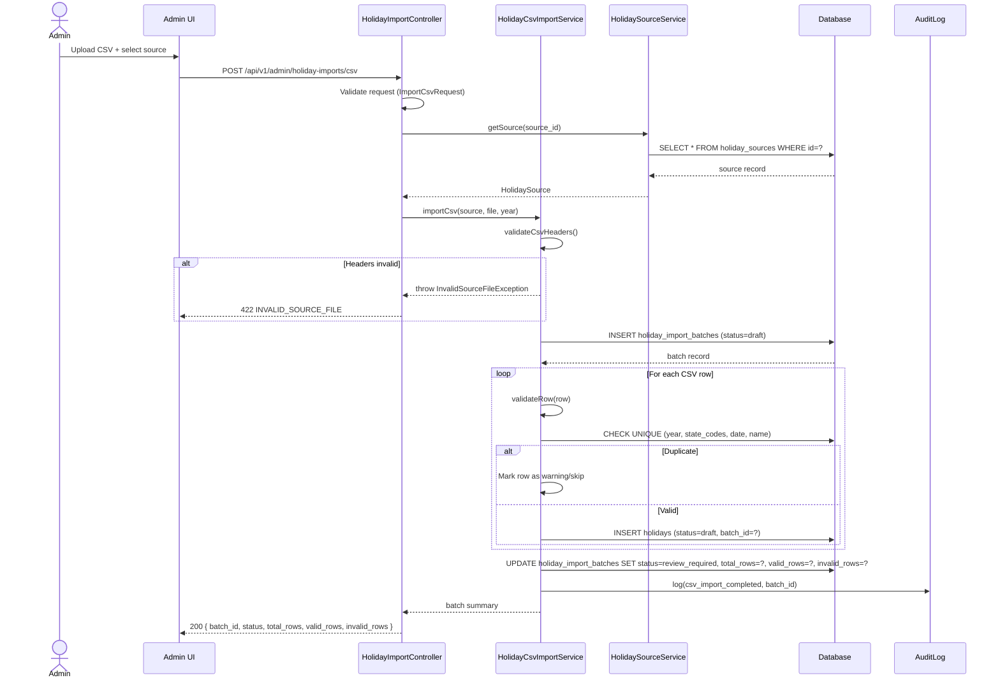
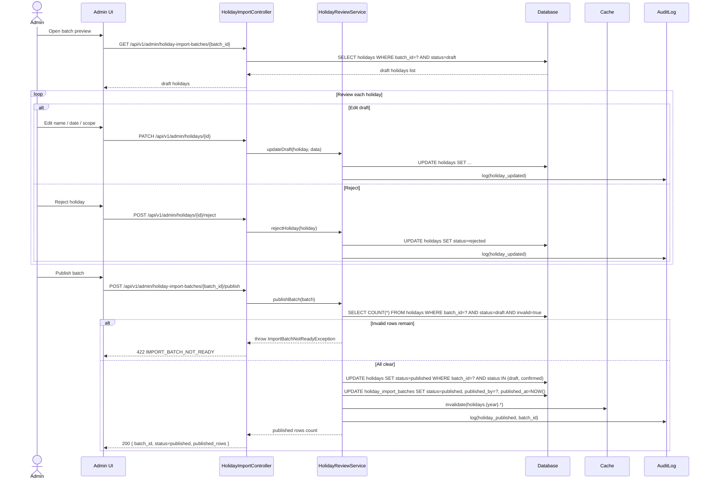
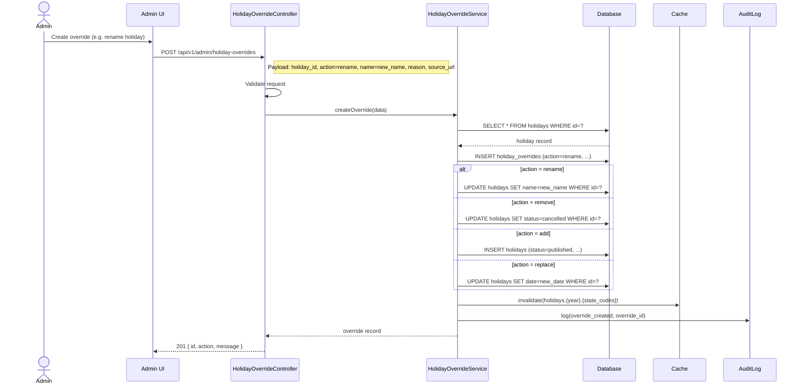
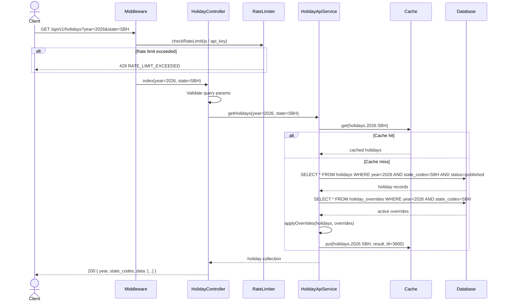
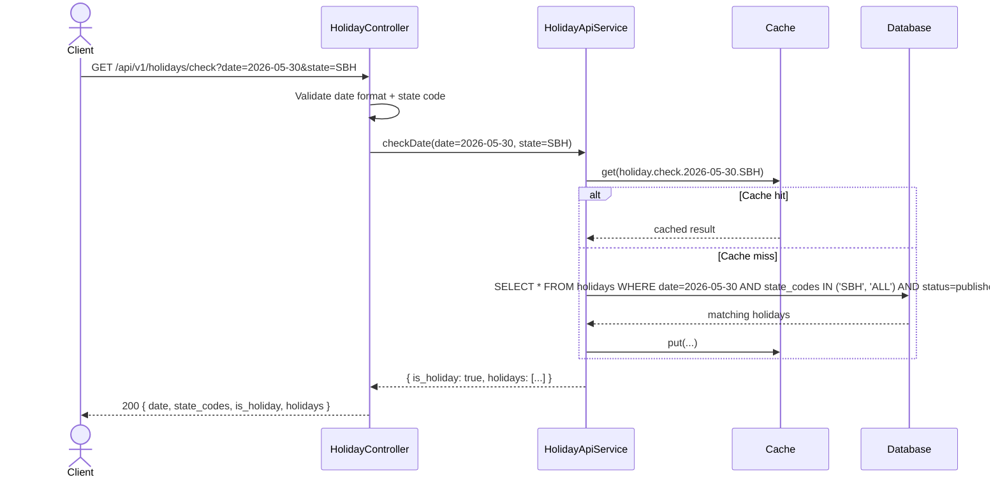
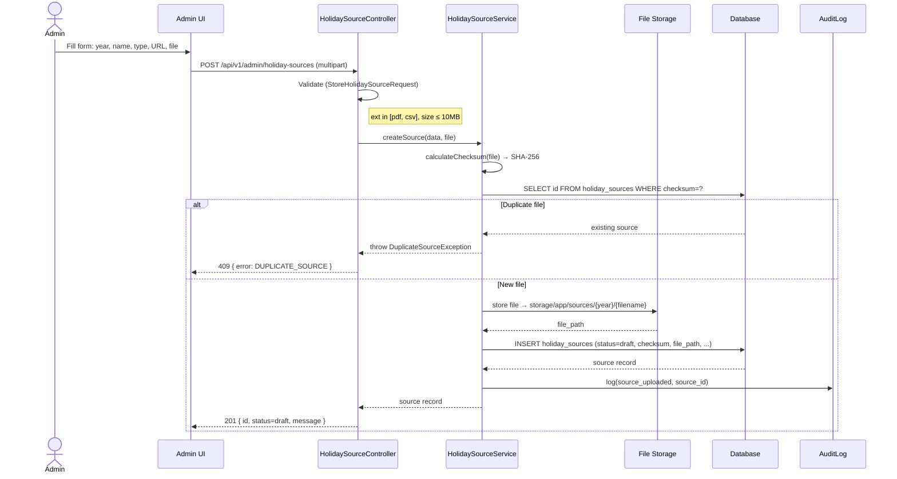
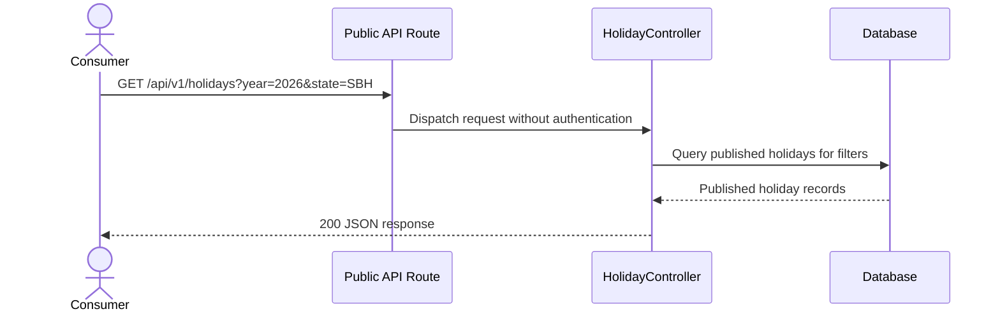

# Sequence Diagrams — Malaysia Public Holiday API

## 1. CSV Import Flow

---

## 2. Admin Review and Publish Flow

---

## 3. Holiday Override Flow

---

## 4. Public API — Get Holidays by Year & State

---

## 5. Public API — Check if Date is Holiday

---

## 6. Source Upload Flow

---

## 7. Public API Request

