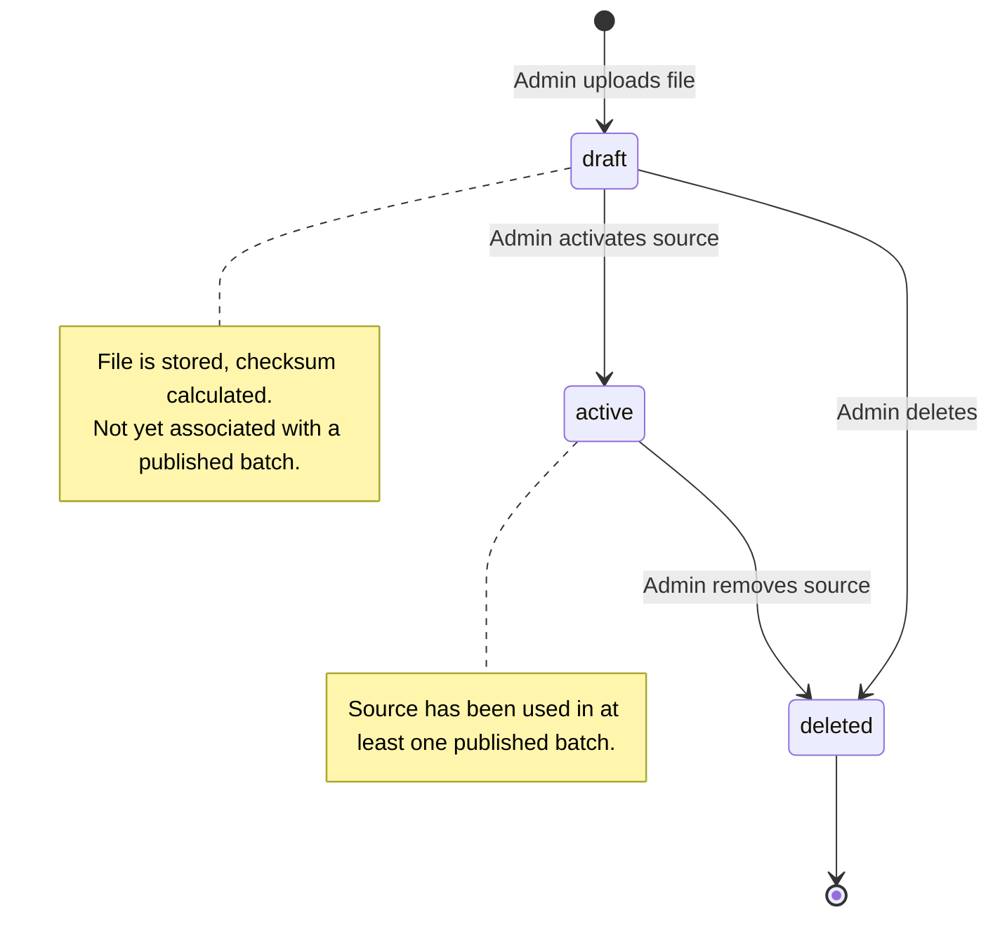
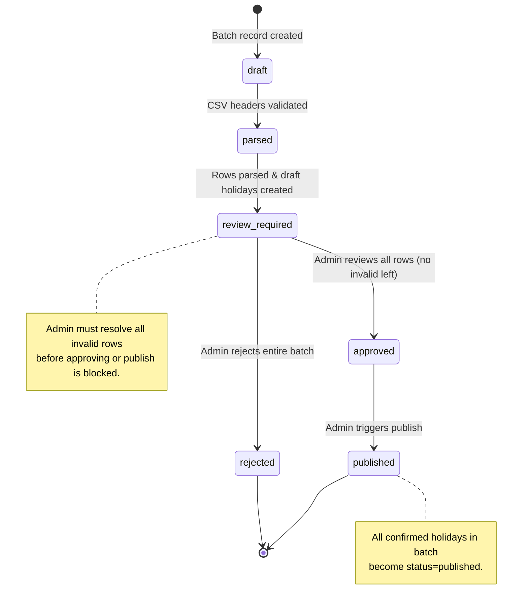
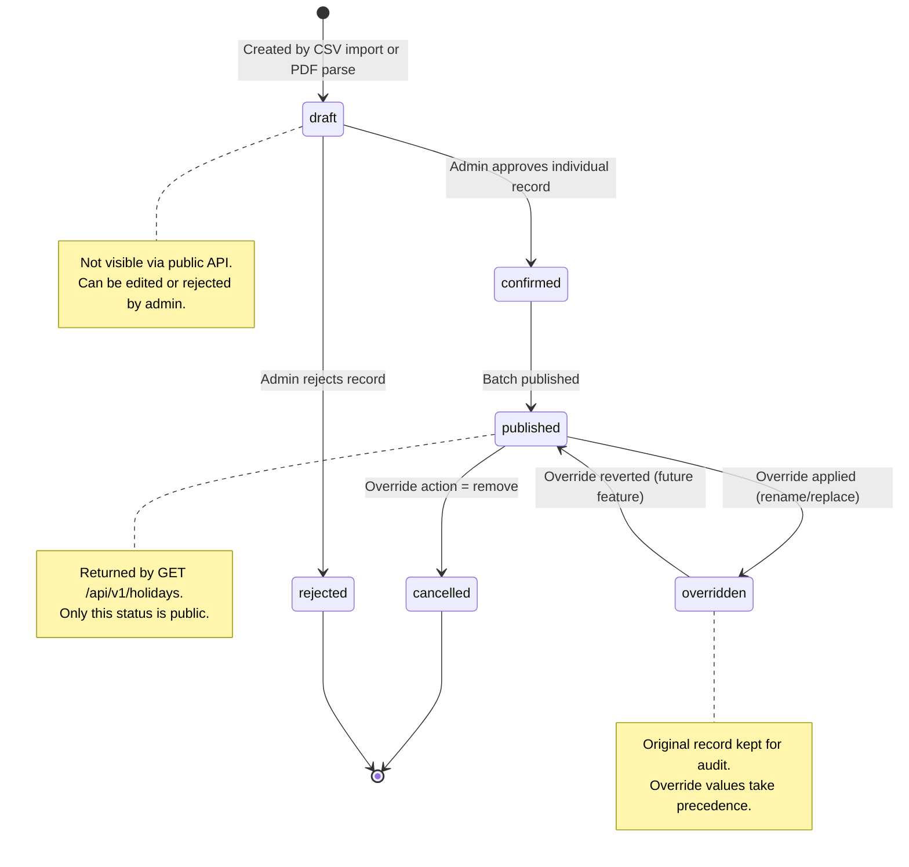
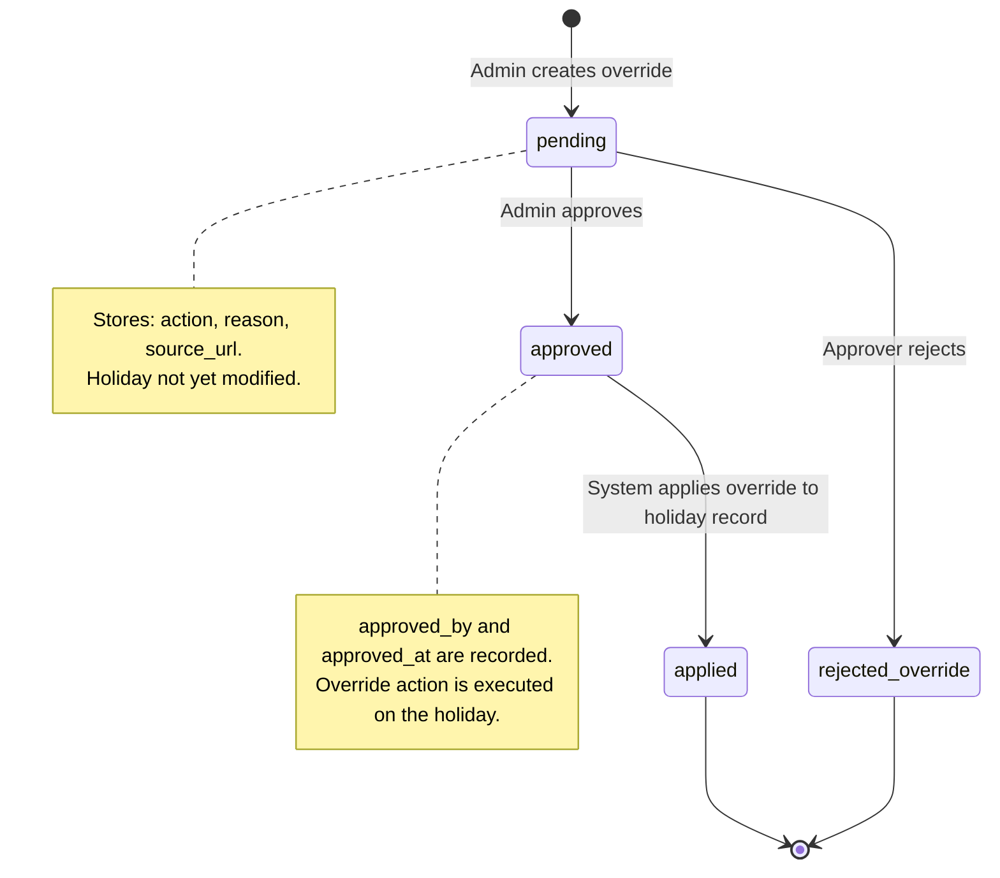
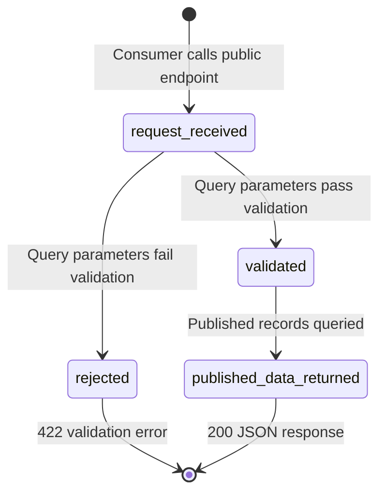
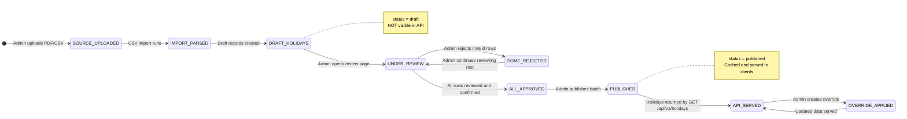
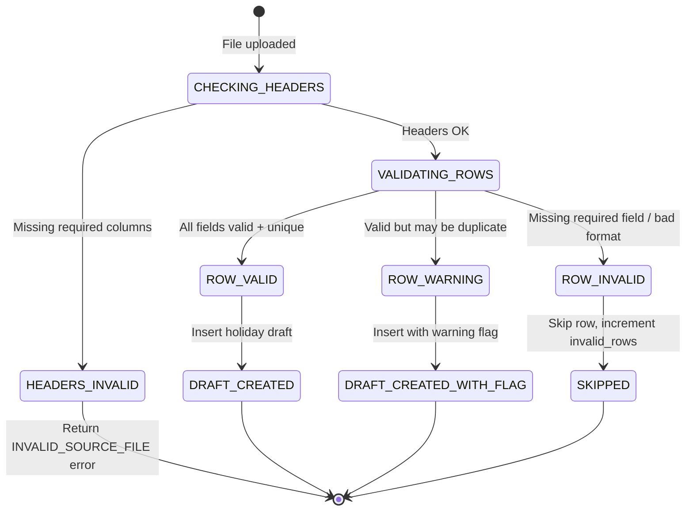

# State Machine Diagrams — Malaysia Public Holiday API

This document describes the lifecycle state machines for all key entities in the system.

---

## 1. Holiday Source — Lifecycle

---

## 2. Holiday Import Batch — Lifecycle

---

## 3. Holiday Record — Lifecycle

---

## 4. Holiday Override — Lifecycle

> **Note:** Admins can approve their own overrides.

---

## 5. Public API Access

---

## 6. Data Trust and Publish Flow (State Machine Summary)

---

## 7. Override Action Effects on Holiday Record

| Override `action` | Effect on `holidays` table |
|---|---|
| `add` | New `holidays` row inserted with `status=published` |
| `remove` | `holidays.status` → `cancelled` |
| `replace` | `holidays.date` updated to new date |
| `rename` | `holidays.name` updated to new name |
| `mark_subject_to_change` | `holidays.is_subject_to_change` → `true` |

---

## 8. CSV Validation State Machine

